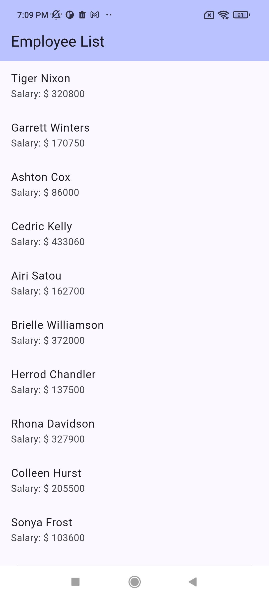
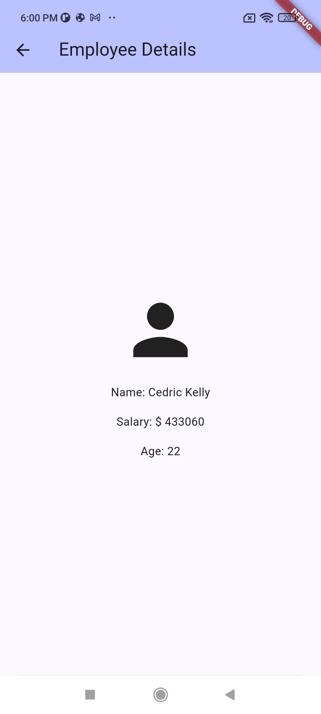

## Data Handling - Getting API local data - Displays a list of employees with their names and salaries

Getting the data of employee list from API: http://dummy.restapiexample.com/api/v1/employees

Used Dio package for request
Used shared prefrences for data caching

Project setup and architecture:
Models folder -> contains the employee model
Controllers folder -> contains the employee controller that calls the api
Views folder -> contains the screen that displays the employees list and their salary 
contains the employee details screen

**Screenshot**

